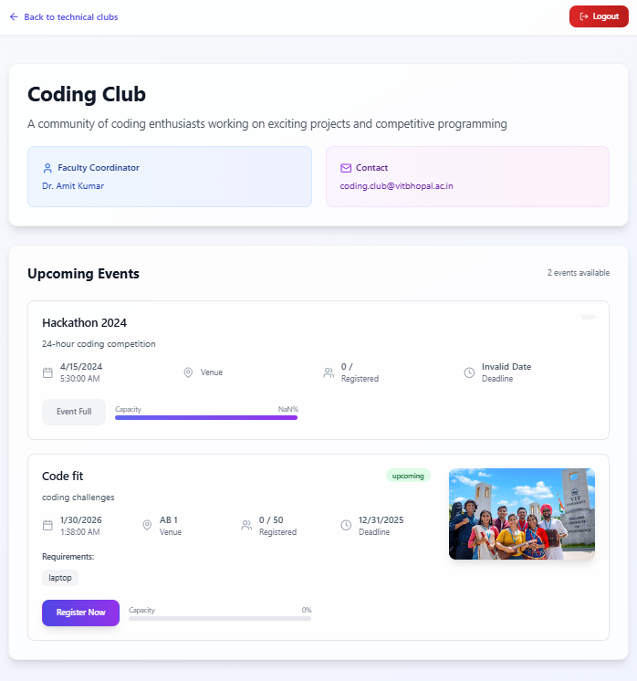

# VIT ClubHub

**A modern student clubs & events platform** — centralizes club management, event creation, registrations, and analytics in a dual-portal (Student + Admin) web app built for colleges. Polished UI, role-based auth, event lifecycle, and easy deployment — designed to impress recruiters and demonstrate full-stack product thinking.

---

# 🚀 Project Overview

VIT ClubHub solves a common student-life problem: fragmented communication across college clubs. Students get a single place to discover clubs, register for events and track participation. Club admins get tools to create/manage events, track attendees and view analytics.

**Why this repo will impress recruiters**
- Real product-sense (roles, event lifecycle, analytics).
- Full-stack implementation (React frontend + Node/Express backend + DB).
- Production-ready patterns: Docker, CI, env management, tests.
- UX-focused with responsive, modern UI.

---

# 📂 Repository Structure (example)

