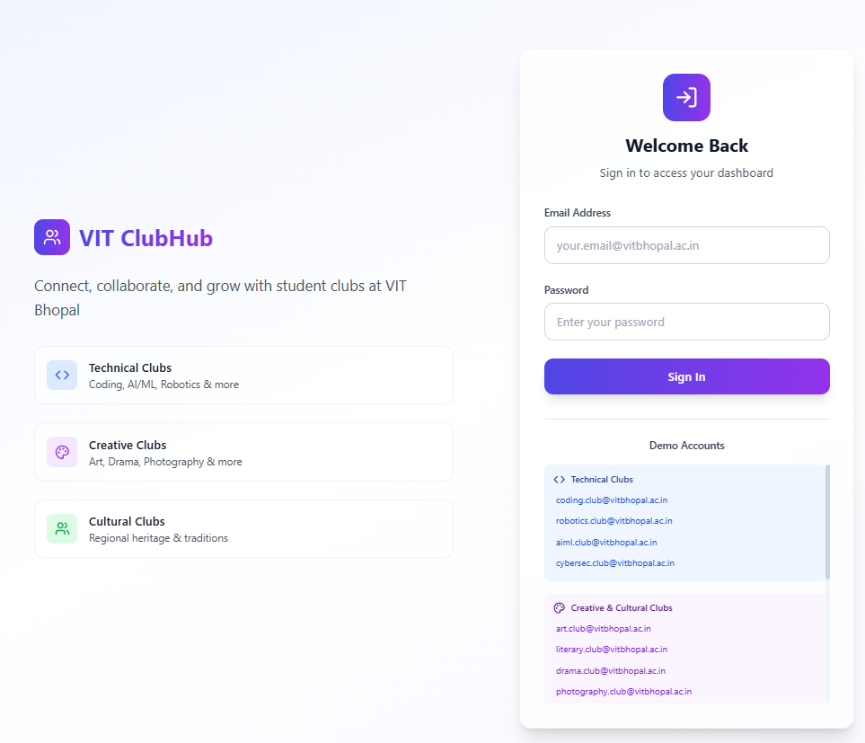
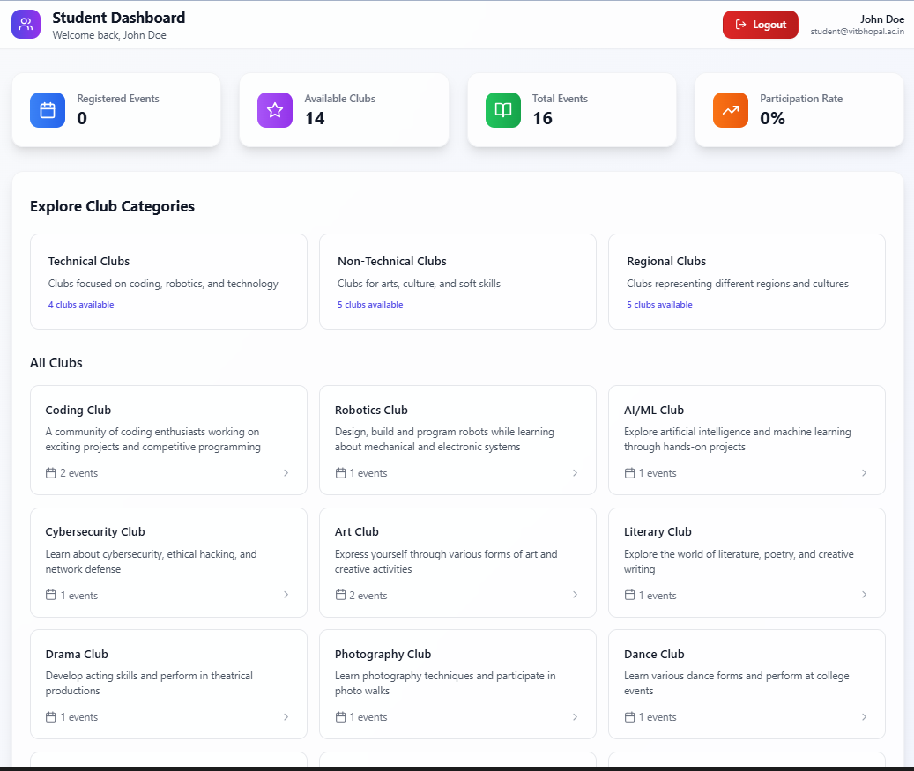
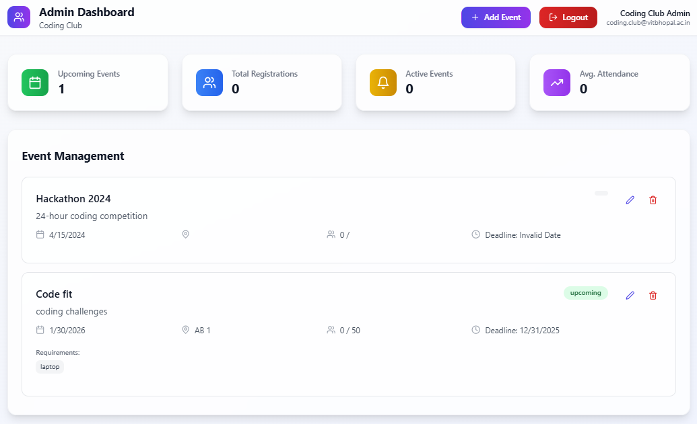

# VIT ClubHub

**A modern student clubs & events platform** — centralizes club management, event creation, registrations, and analytics in a dual-portal (Student + Admin) web app built for colleges. Polished UI, role-based auth, event lifecycle, and easy deployment — designed to impress recruiters and demonstrate full-stack product thinking.

---

## 🚀 Project Overview

VIT ClubHub was built to solve the problem of scattered event communication and email spam among multiple clubs.  
The platform provides a single, smart, and user-friendly interface for students to explore and register for club events — while giving admins a streamlined way to manage and analyze them.

**✨ What makes it impressive for recruiters**
- Real-world problem solving with full-stack architecture.
- Production-quality UI/UX and data-driven design.
- Demonstrates complete software lifecycle: Auth → CRUD → Analytics → Deployment.
- Clean, modular, and scalable codebase.

---

## 🧭 Features

### 🎓 Student Portal
- Browse & join clubs by category (Technical, Non-Technical, Regional).
- View and register for upcoming events.
- Track participation history and rates.
- Responsive and easy-to-navigate dashboard.

### 🧑‍💼 Admin Portal
- Create, edit, and manage events for your club.
- View total registrations and attendance analytics.
- Set deadlines, capacities, and venue details.
- Upload images and event materials.

### ⚙️ Platform Features
- Role-based authentication (Students, Club Admins, Super Admin)
- Event lifecycle: `Draft → Published → Registration Closed → Completed`
- RESTful APIs and secure JWT authentication
- File/image upload (via Cloudinary or local storage)
- Responsive, modern UI built with Tailwind CSS

---

## 🧱 Tech Stack

| Layer | Technology |
|-------|-------------|
| **Frontend** | React.js, Vite, Tailwind CSS, Axios |
| **Backend** | Node.js, Express.js |
| **Database** | MongoDB (Mongoose ORM) |
| **Auth** | JWT-based Authentication |
| **Storage** | Cloudinary / AWS S3 (for event images) |
| **DevOps** | Docker, GitHub Actions, Render/Heroku Deployment |

---

